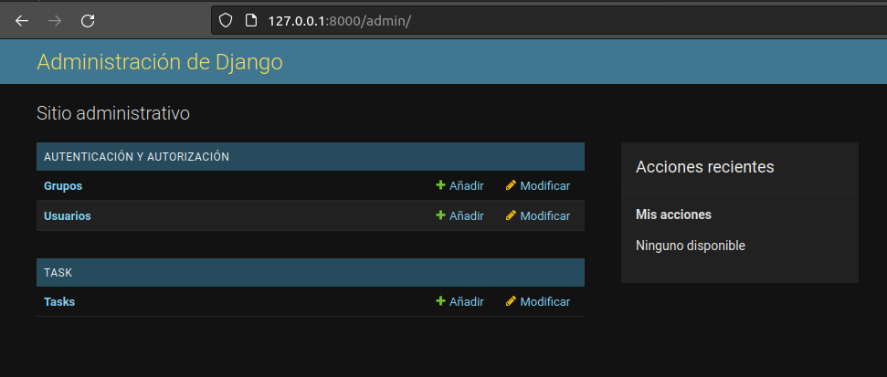

Primero generamos el repositorio en una nueva carpeta task-en-Djando-PatriciaRisgar y un .gitignore con el siguiente contenido:

    *.pyc
    *~
    __pycache__
    myvenv
    db.sqlite3
    /static
    .DS_Store

Despues con el comando mkvirtualenv generamos nuevo entorno virtual llamado env2

Creamos un requirements.txt con contenido: Django~=3.2.10 para hacer la instalacion de Django ejecutamos en el terminal con env2: pip install -r requirements.txt

INICIAMOS NUEVO PROYECTO.

Coninuamos en la carpeta task-en-Djando-PatriciaRisgar

```bash
    django-admin startproject mysite .
```

Se genera carpeta mysite y vamos a modificar los settings:

    TIME_ZONE = 'Europe/Berlin'
    LANGUAGE_CODE = ‘es-es’
    STATIC_URL = '/static/'
    STATIC_ROOT = BASE_DIR / 'static'
    ALLOWED_HOSTS = ['127.0.0.1']

Comprobamos que esté enlazado con la base de datos:

    DATABASES = {
        'default': {
        'ENGINE': 'django.db.backends.sqlite3',
        'NAME': BASE_DIR / 'db.sqlite3',
        }
    }

Desde la terminal en env2 y la carpeta task-en-Djando-PatriciaRisgar usamos:

    ```bash
        python manage.py migrate
    ```

Iniciamos el servidor:

    ```bash
        python manage.py runserver
    ```

En el navegador ponemos http://127.0.0.1:8000/ y veremos el cohete si ha seguido los pasos anteriores.

Hago pull para contunuar despues con la creacion de la app.

CREAR APLICACION

Seguimos trabajando en env2 y la carpeta task-en-Djando-PatriciaRisgar. Con el siguiente comando creamos la aplicacion:

    ```bash
        python manage.py startapp task
    ```

Se nos crea una carpeta con el nombre de nuestra app, en este caso task

Vamos a añadir taks a la settings.py de mysite. Para que reconozca la aplicacion.

    INSTALLED_APPS = [
    'django.contrib.admin',
    'django.contrib.auth',
    'django.contrib.contenttypes',
    'django.contrib.sessions',
    'django.contrib.messages',
    'django.contrib.staticfiles',
    'task',
    ]

Ahora creamos modelo con la clase Task y atributos nombre, descripcion y un boolean Realizada:

    ```python
        from django.conf import settings
        from django.db import models
        from django.utils import timezone

        class Task(models.Model):

            nombre = models.CharField(max_length=200)
            descripcion = models.TextField()
            realizada = models.BooleanField(default=False)

            def __str__(self):

                return self.nombre
    ```

Ahora necesitamos que sqlite genere la base de datos a partir del modelo. Para ello primero preparamos la migracion:

    ```bash
        python manage.py makemigrations task
    ```

Despues aplicamos los cambios usando:

    ```bash
        python manage.py migrate task
    ```

Para poder gestionar nuestra aplicacion nacesitamos un administador, lo creamos desde el fichero admin.py en task

    ```python
        from django.contrib import admin
        from .models import Task

        admin.site.register(Task)
    ```

Generamos la views.py en task:

    ```python
        from django.shortcuts import render
        from .models import Task

        # Create your views here.

        def tasks_list(request):

            tasks = Task.objects.all()
            return render(request, 'task/task_list.html', {'tasks': tasks})
    ```

Necesitamos modificar los ficheros urls.py tando del proyecto 'mysite' como de 'task'.
Comenzamos con mysite:

    ```python
        from django.contrib import admin
        from django.urls import path, include

        urlpatterns = [
        path('admin/', admin.site.urls),
        path('', include('task.urls')),
        ]
    ```

Ya podemos crear el usuario administrador usando la terminal desde env2 y carpeta task-en-Djando-PatriciaRisgar:

    ```bash
        python manage.py createsuperuser
    ```

    Al ejecutar este comando nos pedirá introducir nombre de usuario, email y contraseña.

Vamos a reiniciar el servidor. Usamos Crtl+C para detenerlo y python manage.py runserver para iniciarlo.
En nuestro navegador vamos a ir a http://127.0.0.1:8000/admin/ para logarnos con el usuario que acabamos de crear.

Una vez dentro veremos verlo asi:

